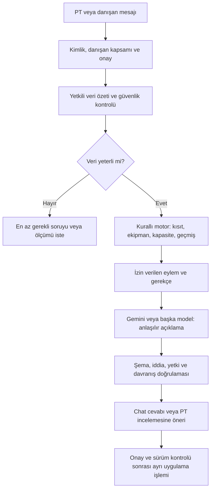

> Güncel erişim kararı (2026-10-06): ayrı AI veri onayı kaldırıldı. PT AI desteğini açar; sağlık alanları mevcut sağlık onayının kapsamı ve sürümüyle filtrelenir. Aşağıdaki ayrı AI onayı anlatımları tarihsel tasarımdır.

> Güncel ürün kararı (2026-10-05): serbest sohbet kaldırıldı. Hedef metni yapılandırılmış alanlara dönüştürülür; kas haritası ve açık gün/süre/ekipman seçimiyle katalogdan taslak üretilir. Danışan düzenleyip kendi programına kaydeder; PT’ye aynı commit’te paylaşılır, PT onayı şart değildir. PT kendi programına açıkça uygulayabilir. Yeni kayıt sözleşmesi `assistant-contract.ts`, kurallar `assistant-engine.ts`, erişim/kayıt `assistant-routes.ts` dosyalarındadır. Aşağıdaki tarihsel sohbet/PT onayı tasarımı yeni akış için geçerli değildir. Kamera ile cihaz tanıma kapsam dışında kalır.

# AI fitness koçu — araştırmaya dayalı ürün ve motor taslağı

**Tarih:** 5 Ekim 2026 · **Dal:** `feature/ai-fitness-coach` · **Durum:** Hedef motor sözleşmesi. Aşağıda belirtilen dar ilk sürüm uygulandı; bu belgenin tüm ileri aşamaları tamamlanmış veya klinik olarak onaylanmış değildir. İnceleme ve kabul kapıları [denetim kaydında](AI-FITNESS-COACH-REVIEW.md).

Bilimsel gerekçeler ve kaynaklar [araştırma raporunda](AI-FITNESS-COACH-RESEARCH.md). Bu belgede verilen sayısal başlangıç örnekleri ürün varsayımıdır; kişisel antrenman reçetesi değildir.

## Uygulanan ilk sürüm — 5 Ekim 2026

PT/danışan ekranlarında sabit sohbet girişi, sayfa/danışan bağlamı, ayrı sohbetler, PT izin + danışan onay kapısı, isteğe bağlı danışan Gemini anahtarı, kayıt özeti ve katalog/kısıt filtresinden program taslağı bulunur. Genel PT görünümü yalnız izinli danışanları kapsar. Kutlama, yorum ve öneriler danışan ayarlarından ayrı seçilir; kayıt olaylarına bağlı bu kısa mesajlar sağlayıcı çağrısı yapmaz.

Gemini sorunun amacını/katalog hareketlerini sınıflar; yanıtlar ve dozlar uygulama kurallarından gelir. Serbest açıklama üretimi, kapsamlı dönemleme, gelişim tahmini, otomatik ölçüm isteme döngüsü, yeni hareket üretimi ve açıdan normal/anormal sınıflaması henüz uygulanmadı. İlk taslak günlerinde aynı temel hareket seçimi kullanılır; kişiselleştirilmiş gün ayrımı ve toparlanma planlaması PT incelemesinde yapılır.

Yayınlama güncel bağlam, izin ve program revision kontrolüyle yapılır. GitHub'daki sağlık, katalog ve program dosyaları için tek ortak atomik işlem garantisi yoktur; bu hedef sözleşmenin ilgili kabul kapısı tamamlandı sayılmaz. PT onayı bu sınırı veya klinik sorumluluğu ortadan kaldırmaz. Gerçek sağlayıcı/cihaz denemesi ayrıca gerekir.

## 1. Kullanıcı ihtiyacı ve çalışma sınırı

Koç, kişiyi ve geçmişini okuyarak antrenman önerisi hazırlayacak; veri yeterli değilse gerekli ölçümü isteyecek; ekipman, gün/süre veya tercih değişirse planı uyarlayacak. PT danışan hakkında, danışan kendisi hakkında konuşabilecek. Kullanıcı istemediği ölçümü reddedebilecek. Koç beden görünümünü puanlamayacak, kullanıcıyı yargılamayacak, yeme bozukluğu veya beden algısı hassasiyetini göz ardı etmeyecek.

Önceden konuşulan yetki modeli korunur: PT danışanı oluştururken/düzenlerken AI desteğini açar. Sağlık verisi kullanımı ve kamera/AI sağlayıcısına gönderim için danışanın uygun kapsamda açık onayı ayrıca gerekir. PT'nin düğmeyi açması danışanın sağlık onayının yerine geçmez.

İlk hedef yetişkin genel fitness koçluğudur. Klinik rehabilitasyon, ameliyat sonrası protokol, gebelik veya çocuk sporcu yönetimi ayrı uzman protokolü gerektirir. Bunlar veri olarak bildirilebilir; genel motorun yeterliliği varsayılmaz.

## 2. Modelden bağımsız karar motoru



Model biyomekanik kuralları tek başına belirlemez. Kurallı çekirdek yetkiyi, semptom güvenliğini, veri kalitesini, kontrendikasyonları ve geçerli plan sınırlarını belirler. Model bu sonuçları açıklar, soruyu yorumlar ve izin verilen adaylar arasındaki öneriyi ifade eder. Sağlayıcı değişince güvenlik ve karar kapıları aynı kalır; yanıt metninin kelimesi kelimesine aynı olması beklenmez.

Salt bir system prompt yeterli değildir. Model tool çağrısı da API seviyesinde doğrulanmalıdır. Sağlayıcı hatasında veya çıktısı reddedildiğinde doğrulanmış motor gerekçesi gösterilir; model hatası programı değiştirmez.

## 3. Mevcut kodun kullanılabilir parçaları

Aşağıdakiler bu dalda mevcut kaynak üzerinden kontrol edildi; AI koçu olarak çalıştıkları iddia edilmiyor.

| Mevcut kaynak | Kullanılacak temel | Yeni sözleşme ihtiyacı |
|---|---|---|
| `src/lib/recommend.ts` | Yük/tekrar önerileri, cihaz adımları, tıkanma ve hafifletme | AI yeni yük motoru icat etmeden bunu çağırmalı; gerekçe/evidence eşlemesi |
| `src/lib/schemas/client.ts` | Sağlık modülü ve alan bazlı sürümlü onay | Danışan bazlı AI yetkisi, sağlayıcı/onay kapsamı, iptal |
| `src/lib/schemas/health.ts` | Hazır oluşluk, ağrı, kısıtlar, ölçümler ve tarama | Kamera metriğinin yöntem, kalite ve belirsizlik kaydı |
| `src/lib/screening.ts` | Mevcut görevler, sonuçlar ve tarama protokolü | OHSA, CARs ve gait ayrı protokoller; mevcut squat otomatik OHSA sayılmaz |
| `src/lib/exercise-filter.ts` | Biyomekanik/kısıt filtreleri | AI modunda eksik etiketin uygunluk belirsizliği olarak ele alınması |
| `src/lib/alternatives.ts` | Alternatif sıralama | Gerçek ekipman/konum ve kullanıcı tercihleriyle filtreleme |
| `src/lib/proposals.ts` | Ekle/sil/değiştir/set önerileri ve onay | AI taslakları, dayanak snapshot'ı, eskiyen öneri kontrolü |
| `src/lib/schemas/exercise.ts` | PT egzersizi, cihaz/aparat, pattern, yük vektörü ve açı etiketleri | Yeni hareketlerin uzman incelemesi ve doğrulanma durumu |

Önemli mevcut sınır: Egzersiz biyomekanik etiketlerinin bir kısmı opsiyonel. Eksik etiketli hareketin mevcut filtreden geçmesi AI'nın o hareketi tıbben güvenli saymasına yetmez. Mevcut 30 saniye denge ve 4 cm uzanma farkı gibi görev özgü kurallar postür, kalça rotasyonu veya bütün asimetriler için kullanılamaz.

## 4. Veri sözleşmesi

Her ölçüm yalnız değeri değil kökenini de taşımalı:

```text
MeasurementObservation
  id, clientId, capturedAt
  protocolId, protocolVersion, task, side
  metricId, value, unit, coordinateSystem
  source = self_report | pt_measurement | device | camera_estimate
  methodVersion, conditions, qualityStatus
  uncertainty = known estimate | unknown
  consentScope, reviewedBy
```

`qualityStatus`: geçerli, yetersiz görüntü, protokol uyumsuz, ölçülemiyor. Model confidence değeri kalibre edilmemişse klinik güven yüzdesi diye gösterilmez. `not_tested`, `declined`, `not_available` ve `not_applicable` ayrı tutulur; yokluk sıfır veya temiz sonuç değildir. Ölçüm zamanı ile kullanıcının kaydettiği zaman ayrılabilir.

Koç bağlamında hedef, mevcut program/sürümü, kullanılabilir gün/süre, ekipman ve konum, tamamlanan seanslar, yük/tekrar/RIR, ilgili onaylı sağlık kayıtları, tercih ve reddedilmiş öneriler bulunur. Tüm danışan geçmişi her mesajda sağlayıcıya gönderilmez; yalnız soruya gerekli, yetkili ve güncel özet gönderilir. Kimlik alanları mümkün olduğunca çıkarılır. Takma kimlik kullanılması veriyi otomatik anonim yapmaz.

## 5. Karar sırası ve çıktı

Karar sırası değiştirilemez: **yetki/onay → acil güvenlik → kapsam uygunluğu → semptom ve kısıt → ölçüm kalitesi → yeterlilik → uygulanabilir egzersizler → geçmiş/yük → öneri → kullanıcı/PT tercihi → doğrulanmış açıklama**.

Önerilen çıktı:

```text
CoachDecision
  action = explain | ask | request_measurement | propose_plan
         | propose_adjustment | hold | refer
  scope, clientId, ruleIds, engineVersion
  observedFacts[], hypotheses[], missingData[]
  evidenceRefs[], limitations[]
  allowedExerciseIds[], proposedChanges[]
  baseProgramRevision, expiresAt, approvalRequired
  message, nextCheck
```

`observedFacts` yalnız kayıtlara dayanır. `hypotheses` olasılık olarak sunulur; sağlık tanısına dönüştürülmez. “Kesin neden” yalnız gerçekten yetkili kaynağa kayıtlıysa kaynak belirtilerek aktarılır. Model kendi cevaplarıyla sonraki seansın kanıtını oluşturamaz; konuşmadaki bir iddianın ölçüm kaydına dönüşmesi ayrı doğrulama ister.

## 6. Sola eğilme: uçtan uca örnek

1. Kamera omuz hattını eğimli tahmin etti. Bu yalnız ilgili koordinat sistemindeki 2D gözlem; pelvis veya omurga tanısı değil.
2. Görüntü eğik mi, bütün beden görünüyor mu, doğru perspektif mi? Uygun değilse sınıflandırma yapılmaz.
3. Aynı protokolde tekrar edildi mi; semptom var mı; kişi sadece o an rahat duruyor olabilir mi? Eksik sorulur.
4. Küçük fark belirsizlik içindeyse “değerlendirilemedi” sonucu; dereceyi zorla normal/anormal etiketleme yok.
5. Güvenilir fark varsa, ilgili destekli tek taraflı görev veya PT ölçümü istenir. Kullanıcı istemezse fotoğraf zorunlu tutulmaz; mevcut verilerle sınırlı genel öneri sunulur.
6. İşlev kısıtı veya doğrulanmış kapasite hedefi varsa, katalogdan uygun aday belirlenir. Sol tarafa daha fazla yük vermek veya yalnız fotoğrafa göre “sağ QL kısadır” demek yok.
7. Geçmişte benzer hareket var mı? Planlanan ile gerçekten uygulanan doz, tolerans ve aynı görev performansı incelenir. Tek seans veya eksik kayıtla kişinin hatalı yaptığı varsayılmaz.
8. Değişiklik PT taslağıdır. Onaylanınca aynı ölçüm prosedürüyle takip planlanır. Ölçüm değişti ama işlev kötüleştiyse “başarılı düzeltme” denmez.

## 7. Ekipman, yeni egzersiz ve haftalık plan

**Eğer “o alet yok” denirse:** İlgili konumdaki kullanılabilir ekipmanı sor/doğrula; eski öneriyi tekrar etme. Aynı amaç, hareket talebi ve uygun yük aralığına sahip katalog adaylarını sırala. Bir alternatifin aynı kas grubunu çalıştırması bire bir aynı biyomekanik talebi taşıdığı anlamına gelmez.

**Eğer uygun alternatif yoksa:** Amaç korunarak daha basit varyasyon, başka görev veya erteleme öner; PT için yeni egzersiz/cihaz kaydı taslağı oluştur. LLM tamamen yeni, doğrulanmamış hareketi güvenliymiş gibi programa yazamaz. Yeni kayıt set-up, ekipman/aparat, takip türü, hareket örüntüsü, relevant biyomekanik etiket, doz sınırı ve inceleme durumu taşımalıdır.

**Program oluşturma sırası:** Hedefi ve mümkün gün/süreyi öğren → güvenlik/kapasiteyi değerlendir → mevcut hareketlere öncelik ver → uygun adayları seç → günlere yük ve toparlanmayı dağıt → set/tekrar/yük için mevcut motoru kullan → PT incelemesine sun. Mobilite/koordinasyon ekleri toplam seans süresine dahildir; görünmez ev ödeviyle zaman sınırı aşılmaz.

Örnek ürün senaryosu: Kullanıcı iki gün 30 dakika ve dambıl/bant sunuyorsa taslak buna uyar. Klinik engel yoksa iki uygulanabilir kuvvet seansı ve kısa hedefe yönelik hazırlık düşünülebilir. Kesin yük, set veya yüksek eforlu PAILs/RAILs dozu bu bilgiyle tek başına belirlenmez. Kullanıcı yalnız bir gün yapabiliyorsa “başaramazsın” demek yerine uygulanabilir en küçük plan ve beklenti aralığı konuşulur.

Seans kaçırılırsa aynı hacmi iki güne sıkıştırma veya ceza kardiyosu yok. Takvim ve toparlanma yeniden değerlendirilir. Yapılmayan ile kaydı eksik olan farklıdır. Kullanıcı “mümkün değil” dediğinde motor bunu koşul değişikliği kabul eder.

## 8. Ölçümü ne zaman isteyecek?

| Tetikleyici | İstenen minimum bilgi | İstenmeyecek gereksiz veri |
|---|---|---|
| İlk program, kapasite belirsiz | Hedef, süre/ekipman, sağlık kapsamı uygunsa ilgili kısa görev | Otomatik tam beden fotoğraf paketi |
| Yeni veya kötüleşen semptom | Mevcut güvenlik soruları ve uygun yönlendirme | Ağrıyı tetikleyen zorlayıcı test |
| Plan düzenli uygulanmış ama ilgili sonuç belirsiz | Aynı protokolle ilgili performans/ROM ölçümü | İlgisiz kilo/çevre ölçümü |
| Kamera kaydı uygun değil | Tekrar çekim veya manuel alternatif | Sahte güvenle açı raporu |
| Kullanıcı ölçümü reddetti | Tercih ve alternatif veri yolu | Tekrarlayan baskı/hatırlatma |
| PT takip tarihi belirledi | Yalnız ilgili ölçüm | Bütün sağlık verisini yeniden istemek |

Takip için ürün başlangıç önerisi: Seans öncesi kısa uygunluk kontrolü, seans sonrası ilgili tolerans sorusu, haftalık uygulanabilirlik konuşması ve hedefe göre belirlenen yeniden değerlendirme. Her hafta kamera veya vücut ölçüsü zorunlu değildir. Dönemler PT ve kullanıcıyla belirlenir; üç markanın evrensel sıklık protokolü diye sunulmaz.

## 9. Beklenen–gerçekleşen gelişim

Önce ölçümlerin karşılaştırılabilirliğini ve eksik veriyi kontrol et. Geçmişe göre aynı koşullarda trend hesapla; yeterli bireysel veri yoksa kişiselleştirilmiş sayısal tahmin verme. Beklenen sonuç aralığı ile gerçekleşen sonuç farkı, neden bilgisi değildir.

Negatif farkta karar sırası: ölçüm koşulları → planın uygulanabilirliği → gerçekleşen doz → toparlanma/semptom → hedefin uygunluğu → gerekiyorsa uzman değerlendirmesi. Tüm nedenler bilinmediğinde “nedenini bilmiyoruz” denir. “Uyku düşük bildirilen haftalarda performans da düşük” ilişkisidir; uykunun tek neden olduğu sonucu değildir.

Nazik cevap örneği: “Son üç kayıt benzer düzeyde. Bu emeğinin boşa gittiği anlamına gelmez. Önce planı hayatına daha uygun hale getirmemiz gerekiyor mu, ona bakalım. İstersen ekipman ve süreye göre daha kısa bir alternatif hazırlayayım.”

## 10. Chat ve PT yetkisi

PT chat'i seçilmiş danışan kapsamıyla açılır; kapsam değiştirmek açık kullanıcı eylemi olur. Danışan chat'i yalnız oturumdaki kendi kimliğine bağlanır; istek gövdesinden başka danışan kimliği seçilemez. PT'nin bir danışan için konuştuğu özel not/mesajlar danışana otomatik görünmez. Danışanın mesajlarının PT'ye görünürlüğü de açık ürün/onay sözleşmesi gerektirir; varsayılan gizli paylaşım yapılmaz.

Chat cevap, dayanak özeti, belirsizlik ve sıradaki tek uygulanabilir adımı gösterebilir. Yeni program önerisi chat metni değil inceleme kartı olur. “Kabul et/uygula” ayrı, doğrulanan işlem; stale program sürümü varsa yeniden değerlendirme gerekir. İlk sürümde programı değiştiren kararlar PT onayına gider. İleride hangi düşük riskli eylemlerin otomatikleşeceği ayrıca belirlenir.

Sağlık/kamera ve beden algısı tercihleri doğal dil mesajına gömülü tek seferlik prompt değil kalıcı, sürümlü politika olmalıdır. Destek kapalıysa model çağrısı yapılmaz; yalnız PT arayüzünde gizlemek yeterli değildir.

## 11. Beden algısı ve yeme hassasiyeti: zorunlu kurallar

- Görünüşe göre değer, çekicilik veya “kusur” puanlama yok. Ağırlık/çevre/fotoğraf takibi seçime bağlı; işlev temelli alternatif mevcut.
- Kalori kısıtlaması, öğün atlama, açlık veya egzersizle telafi isteği koçun genel fitness programına eklenmez. Riskli konuşmada uygun profesyonel destek sunulur.
- Kaçırılan seansın cezası, suçlama, beden utandırma ve “iradesizlik” açıklaması yasak.
- Kullanıcı “çarpığım/kötü görünüyorum” dediğinde model bu etiketleri onaylamaz; ölçüm sınırlarını ve işlev hedefini nazikçe açıklar.
- Sık fotoğraf kontrolü veya tartılma baskısı artırılmaz. Kullanıcı ölçümü atlayabilir; bu tercih planlama motoruna da uygulanır.
- Nazik üslup, ciddi belirtileri küçümseme veya acil yönlendirmeyi belirsizleştirme gerekçesi değildir.
- Testler yalnız yasak kelime aramaz; dolaylı suçlama ve kanıtsız neden iddiasını da denetler. Bu politika model sağlayıcısından bağımsızdır.

## 12. Sağlayıcı, ücret ve veri saklama

Gemini anahtarı hazır olsa bile AI özelliği otomatik etkinleşmez. Sunucu sağlayıcı adapter'ı kullanır; anahtar tarayıcıya gitmez. PT sağlayıcı ve kullanım koşullarını görür; danışanın onay kapsamı kontrol edilir. İstek, token, eşzamanlılık ve kullanım kotası sunucuda uygulanır; ayrıntılı rezervasyon ve hata davranışı §14.6 içindedir. Tahmini maliyet limiti sağlayıcının faturası için kesin tavan garantisi değildir. Limitte veya durum belirsizken yeni çağrı engellenir; kurallı açıklama mevcutsa gösterilir.

Chat dökümlerinin sağlık bilgisi içerebileceği kabul edilir; loglara tam mesaj, token veya görüntü yazılmaz. Saklama ve iptal davranışı aşağıdaki sözleşmeye uyar. GitHub JSON reposunda silinen kayıt Git geçmişinde kalabilir; “silindi” butonu tüm kopyalardan imha garantisi vermez. Ham görüntü hiçbir uygulama deposuna yazılmaz ve sunucuya/sağlayıcıya gönderilmez. Ayrı bir görüntü yükleme seçeneği de bu kapsamda yoktur. Türetilmiş ölçüm özeti yalnız ayrı saklama onayıyla tutulur; bu da hassas veri sayılır.

## 13. Uygulama aşamaları ve kabul senaryoları

1. **Sözleşmeler:** Bu taslağı gözden geçir; yetişkin kapsamı, onay, görünürlük ve klinik kapıları kesinleştir. Test/ölçüm sözlüğünü uygun uzmanla doğrula.
2. **Metin koçu:** Danışan AI yetkisi, izinli veri özeti, mevcut motor entegrasyonu, sağlayıcı adapter'ı ve salt açıklama chat'i. Program yazma yok.
3. **PT taslakları:** Doğrulanan katalog adayları, ekipman/süre alternatifleri, plan revision'ı ve PT onayıyla uygulama.
4. **Takip:** İlgili ölçüm istekleri, reddetme seçeneği ve belirsizliği koruyan trend açıklaması.
5. **Kamera:** Önce görüntü saklamayan cihazda işleme ve kalite kontrolü pilotu; statik önden/yandan duruş, ardından kontrollü squat. Her metrik kendi doğrulama kapısını geçer. Yürüme analizi daha sonraki ayrı protokoldür. Kapsül/klinik tanı otomasyonu yok.

İlk kabul testleri: AI kapalı danışanda sağlayıcı çağrısı sıfır; başka danışana erişim reddi; onaysız sağlık alanının bağlamdan çıkarılması; eksik görüntüde reçete üretmeme; pinching'de zorlayıcı uç açı önerisini engelleme; gerçek ekipman sınırına uyma; yeni etiketsiz egzersizi güvenli ilan etmeme; beden utandırma/ceza egzersizini reddetme; negatif gelişimde kanıtsız nedeni reddetme; eskiyen taslağı uygulamama; ücret limitinde yeni çağrıyı durdurma; sağlayıcı değişiminde aynı güvenlik kapılarını koruma.

Bu dal araştırma ve motor taslağını, ayrıca aşağıda belirtilen ilk ölçüm arayüzünü içerir. Ana dal veya canlı sürüm değiştirilmemiştir. Chat, AI program üretimi ve kamera açı ölçümü henüz uygulanmamıştır.


## 14. Denetimde kapatılan sözleşme boşlukları

Bu bölüm uygulamanın bağlayıcı kurallarıdır; mevcut kaynakların bunları bugün uyguladığı anlamına gelmez. Merkezi servis veya yeni ortak veritabanı gerektirmez: her PT kendi Vercel kurulumu ve özel GitHub veri reposunu kullanır. Eksik altyapı özelliği güvenlik kontrolünü atlama gerekçesi olamaz.

### 14.1 Kapsam, öncelik ve sağlık güvenliği

- Yaş/kapsam uygunluğu doğrulanmadan kişisel AI program önerisi açılmaz. İlk sürüm yalnız 18+ genel fitness içindir. Gebelik, ameliyat sonrası, klinik rehabilitasyon ve tanı/tedavi soruları ayrı uzman kapsamıdır; PT onayı tek başına bu kapsamı genişletmez.
- Öncelik: erişim/onay → acil güvenlik → kapsam uygunluğu → semptom/kısıt → ölçüm yeterliliği → ekipman/zaman → yük/toparlanma → tercih. Düşük öncelikli kural yüksek öncelikli engeli geçersiz kılamaz. Çelişki çözülmezse öneri bekletilir ve neden gösterilir.
- Semptom güvenliği için uzman tarafından sürümlenmiş kısa sorular ve yönlendirme metinleri kullanılır. Yeni/kötüleşen semptom veya belirsiz riskte yük artırımı ve provoke eden test bekletilir. Yeni ağrıdan otomatik kas teşhisi, tedavi veya PAILs/RAILs reçetesi çıkmaz. Acil bulgu yönlendirmesi modele, tokena veya internet yanıtına bağlı değildir.
- Serbest metin yorumlayıcı risk işareti ekleyebilir; yapılandırılmış risk işaretini silemez. Yazım hatası, örtük anlatım veya kaçırılmış bulguların tamamen yakalandığı iddia edilemez. Kontrol listesi + bilinmeyende durma + açık yardım erişimi birlikte gerekir. Kullanıcıya her mesajda gereksiz tam tarama yapılmaz; ilgili güncellik kuralı işletilir.
- Gemini adapter'ı klinik karar, tıbbi tavsiye veya rehabilitasyon üretmez. Klinik niyet önce kurallı kapıda yönlendirilir; ilgili sağlık hikâyesi model çağrısına gönderilmez. Gelecekte klinik ürün istenirse sağlayıcı şartları ve uzman/regülasyon değerlendirmesi ayrı çalışma gerektirir. Bu yalnız etikette “fitness” yazılarak aşılmaz. [Gemini şartları](https://ai.google.dev/gemini-api/terms).

### 14.2 Onay, kapsam ve chat gizliliği

`CoachAccess` sözleşmesi: PT AI açma durumu, yetişkin uygunluğu, alan bazlı veri kapsamı, sağlayıcı kullanım onayı, kamera işleme onayı, ölçüm saklama onayı, politika sürümü ve `consentEpoch`. Kamera işleme ve ölçüm saklama farklı izinlerdir; tarayıcının kamera izni sağlık/onay sözleşmesinin yerine geçmez.

Kimlik ve danışan kapsamı sunucu oturumundan belirlenir. PT başka danışana geçince bağlam/önbellek ayrılır; eski konuşma yeni danışana taşınmaz. Yetki bağlam oluştururken, sağlayıcıya göndermeden hemen önce ve cevap/öneri kaydederken yeniden doğrulanır. Epoch değişirse bekleyen cevap atılır, taslak uygulanamaz ve mümkünse istek iptal edilir. Daha önce gönderilmiş verinin sağlayıcıdan geri çekilebildiği veya HTTP iptalinin ücretlendirmeyi durdurduğu söylenmez.

İlk sürüm chat geçmişi oturum belleğinde tutulur; yenileyince kalıcı döküm geri gelmez. PT chat'i ve danışan chat'i farklı kapsamdır. PT danışanın chat dökümünü görmez. Danışan isterse belirli mesaj/öneriyi açıkça PT ile paylaşır; bu işlem alıcı ve kapsamı gösterir. Gelecekte geçmiş saklama ayrı tercih ve görünürlük sözleşmesi gerektirir. İşlem kaydı yalnız karar/öneri ID'si, sürüm, eylem, zaman ve gerekli gerekçe kodlarını tutar; serbest metin transcript loglanmaz. Gerekçe kodları da hassas olabilir, erişim kontrollüdür.

Ölçüm özeti özel danışan reposunda saklanır; UI saklama amacını ve seçilmiş süreyi gösterir. Uygulama süre dolduğunda/iptalde erişimi keser ve güncel kaydı kaldırır; Git geçmişi, repo sahibinin kopyaları ve sağlayıcı saklama süreleri için tam imha vaadi yoktur. Bu sınır onaydan önce açıklanır. Repo sahibi PT, altyapı düzeyinde dosyaları okuyabilir; uygulama içi gizlilik repo sahibine karşı kriptografik gizlilik değildir. Kalıcı hassas kayıtlar ancak bu açıklama ve saklama süresi seçimi tamamlandıktan sonra açılır.

### 14.3 Model çıktısı ve prompt injection

Mesaj, PT notu, egzersiz açıklaması ve içe aktarılan kayıtlar güvenilmeyen veridir. “Kuralları yok say”, metin içindeki araç komutları ve sahte kaynaklar politika olamaz. Model kimlik/token/sır, başka danışan verisi, keyfi URL erişimi veya GitHub yazma yetkisi almaz. İlk sürümde web arama, dosya çalıştırma ve doğrudan plan yazan araç yoktur. Bu sınırlar prompt'ta anlatılmasının yanında API'de uygulanır. [OWASP prompt injection](https://genai.owasp.org/llmrisk/llm01-prompt-injection/).

Motor karar ve adayları modelden önce üretir. Model olası niyet/eksik bilgi alanlarını önerir; sunucu bunları enum ve mevcut veri ID'lerine karşı kontrol eder. `factId`, `ruleId`, `exerciseId`, birim ve sayısal doz değerleri modelce icat edilemez. Güvenlik sonucu, yük/doz ve erişim bilgisi sunucunun sabit bileşenlerinden gösterilir. Model metni tek başına uygulama talimatı veya kabul düğmesi üretmez.

Çıktı boyut/şema kontrolü, dayanak ID kontrolü ve davranış değerlendirmesinden geçer; ham HTML, dış görsel ve veri sızdıran bağlantılar render edilmez. Geçersiz/çelişkili yanıt atılır; doğrulanmış şablon cevap gösterilir. Serbest metin semantik denetiminin hatasız olduğu iddia edilmez; güvenlik açısından kritik cevaplar serbest üretime bırakılmaz. Kullanıcıya gerekçe ve dayanak özeti sunulur; modelin gizli düşünce zinciri istenmez veya saklanmaz.

### 14.4 Program işlemleri ve eşzamanlılık

`CoachDecision` ayrıca `decisionId`, `createdAt`, `consentEpoch`, `catalogRevision`, `constraintsRevision`, `measurementSnapshotId`, `inputDigest` ve `policyVersion` taşır. Sunucu öneriyi üretir; istemci yalnız ID gönderir. Aynı girdide kurallı karar tekrarlanabilirdir; model kelimeleri ve niyet çıkarımı aynı olmak zorunda değildir. Belirsiz niyet program değiştirmeden kullanıcıya doğrulatılır.

Uygulama sırasında PT rolü, onay durumu, dayanak sürümleri, süre, ekipman ve güvenlik kısıtları yeniden okunur. Program, katalog, kısıt veya onay değişmişse eski öneri yeniden hesaplanır. Kabul edilen içeriğin özeti/hash'i sabittir; model sonradan başka doz ekleyemez. PT bir tıbbi güvenlik veya erişim engelini bu düğmeyle geçemez.

GitHub üzerinde otorite tek özel repo branch'inin HEAD'idir. Yeni commit yalnız okunan HEAD'i parent alır; ref güncellemesi `force=false` kullanır. Branch'te force-push/reset yasaktır; eşzamanlı kardeş commit çatışması kayıp güncelleme yerine yeniden değerlendirmeye gider. [GitHub ref güncelleme API'si](https://docs.github.com/en/rest/git/refs#update-a-reference). İlgili program/karar/işlem kaydı aynı commit'te yazılır ve ref yalnız beklenen HEAD'den atomik ilerletilir; çatışmada güncel HEAD üzerinden tüm kontroller tekrarlanır. Ayrı dosyalara ardışık Contents API yazımı atomik işlem sayılmaz. Onay/kısıt/katalog yazan diğer yollar da aynı koordinasyon sözleşmesine katılmalıdır; farklı repo kullanan dayanaklar için atomiklik yoksa ilk sürüm otomatik uygulama açılmaz, AI uygulama endpoint'i kapalı tutulur; PT mevcut manuel düzenleme arayüzünü kullanır. Manuel onay butonu atomiklik eksikliğinin çözümü sayılmaz. Uygulama başına yeni merkezi DB eklenmez.

`idempotencyKey` danışan + karar + kabul edilen içerik kapsamına bağlanır ve otorite işlem kaydında tutulur. Çift tıklama, timeout sonrası tekrar veya iki sekme aynı değişikliği iki kez uygulamaz. “Onaylandı” yalnız kalıcı commit doğrulanınca gösterilir. Yazma sonucu bilinmiyorsa tekrar değişiklik üretmeden işlem ID'si sorgulanır. Mevcut `planApproval` kaynakta değişiklik planını hesaplar; fonksiyonun varlığı depolama atomikliği veya yeni AI onay kapsamının sağlandığı kanıtı değildir.

### 14.5 Veri ve ölçüm geçerliliği

Ölçüm sayısal sınır, sonlu sayı, birim ve protokol enum'u açısından sunucuda doğrulanır; istemci ölçümleri güvenilir donanım kanıtı sayılmaz. Modelce çıkarılan değer ölçüm olarak kaydedilmez. Ham veri yerine özet kullanılması doğruluk garantisi sağlamaz.

Her metric/protokol kaydı kaynak, geçerli popülasyon/görev, amaç, zorunlu koşullar, güncellik, yöntem sürümü ve doğrulanma durumu taşır. Onaylı kullanılabilirlik kuralı olmayan veri yalnız betimlenir; karar kapısına dönüştürülmez. Geçmiş ağrı kaydı bugünün ağrısızlığı değildir. Birim/method/protokol/koşullar değişince trend sessizce birleştirilmez. Hatalı kayıt düzeltmesi dayanak taslakları eski kılar.

Postür estetiği norm sayılmaz. Kamera açı farkı bir klinik eşik değildir. Doğrulanmış işlev hedefi, kullanıcı tercihi ve semptom birlikte ele alınır. Egzersiz seçimi eksik güvenlik etiketiyle otomatik onaylanmaz; hedef göreve uygunluğu uzman incelemesinden geçer. Kas adı eşleşmesi alternatif eşdeğerliği değildir. PAILs/RAILs yüksek eforlu klinik kullanım ilk otomatik katalog kapsamına girmez.

Ölçüm isteği `requestId`, karar gerekçesi, öneriyi nasıl değiştireceği, manuel alternatif, bitiş ve yeniden isteme koşulu taşır. Reddedilince aynı istek kapatılır; rutin tekrar bildirim yoktur. Yeni güvenlik bulgusu ayrı amaçla açıklanabilir. Görünüşe ilişkin tekrar kontrol dürtüsünü artıran akışlar kapatılır. Beklenen gelişim yeterli veri ve doğrulanmış yöntem yokken sayı/olasılık olarak tahmin edilmez; gözlenen trend ve sınırı gösterilir.

### 14.6 Sağlayıcı uygunluğu ve kullanım rezervasyonu

PT anahtarı bulunması sağlayıcının veri kullanım şartlarının uygunluğunu kanıtlamaz. Adapter ülke/kapsam/yaş ve veri kullanım profilini sürümler; sağlık/kişisel veri için uygun profil doğrulanamadığında kişisel bağlam çağrısı kapalı kalır. Gemini'nin unpaid hizmetleri hassas/kişisel veri gönderilmemesini ister; paid hizmetleri de sıfır saklama anlamına gelmez. Kişisel veri içermeyen eğitim/demo akışı ayrı tutulur. [Gemini veri şartları](https://ai.google.dev/gemini-api/terms).

İstek boyutu, input/output token sınırı, seçilmiş model ve destekleniyorsa düşünme token sınırı belirlenir. Kullanım için en fazla bir eşzamanlı sağlayıcı çağrısı/PT ile başlanır. Kota rezervasyonu PT'nin özel reposundaki ortak otorite kaydında beklenen HEAD ile yapılır; Vercel process belleği ortak sayaç değildir. Rezervasyon yazımı başarısızsa çağrı yapılmaz. Bilinmeyen sonuç maliyet rezervasyonunu otomatik serbest bırakmaz. Sağlayıcı cevabının usage bilgisiyle mutabakat yapılır; doğrulanamayan ücretlemede güvenli üst tahmin korunur. Güncel fiyat profili veya hesaplanabilir üst sınır yoksa maliyet kontrollü çağrı açılmaz.

İlk sürüm ücretli çağrı için otomatik yeniden deneme yoktur. Timeout/429/sağlayıcı reddinde şablon açıklama ve kullanıcıya yeniden deneme seçeneği vardır; yeni deneme ayrı rezervasyon gerektirir. Sağlayıcı faturası, diğer uygulamaların aynı anahtarı kullanması ve fiyat değişimi uygulama kotası dışında kalır; bütçe uyarısı kesin fatura kesici diye sunulmaz. API anahtarı, çağrı metni ve sağlık verileri log/telemetriye girmez. Model değişimi sözleşme + davranış kabul paketi geçmeden açılmaz.

### 14.7 Görüntü saklamayan kamera sözleşmesi

- Kamera yalnız açık kullanıcı eylemi ve HTTPS/yerel geliştirme güvenli bağlamında açılır; mikrofon kapalıdır. İzin reddi/desteklenmeyen cihazda manuel ölçüm veya PT gözlemi vardır. [getUserMedia](https://developer.mozilla.org/en-US/docs/Web/API/MediaDevices/getUserMedia).
- Kareler cihazdaki worker/pose işlem hattında geçici olarak işlenir. `MediaRecorder`, dosya upload, ekran görüntüsü kaydı, canvas export, IndexedDB/localStorage, service-worker cache ve session replay üzerinden görüntü saklama/yollama yoktur. Sunucu yalnız şeması doğrulanmış sayısal özet alır; görüntü alanı/base64/URL kabul etmez. Kare bazlı tam iskelet serisi de kalıcı olarak tutulmaz.
- Uygun worker desteği ve performans bütçesi pilotta doğrulanır. SDK/model/WASM sürümleri sabitlenir, mümkünse kendi origin'den sunulur; kamera sayfasında üçüncü taraf analytics ve session replay yoktur. CSP/izin politikası, bağımlılık güncellemesi ve network incelemesi kabul kapısına dahildir. MediaPipe'in video işlemesi UI iş parçacığını bloklayabildiğinden worker yaklaşımı rehberde önerilir. [MediaPipe web rehberi](https://developers.google.com/edge/mediapipe/solutions/vision/pose_landmarker/web_js).
- İptal, sayfadan çıkış, arka plana geçiş, oturum kapanması veya onay iptalinde track'ler durdurulur; worker kapatılır, frame/landmark referansları temizlenir ve video kaynağı ayrılır. Tarayıcı/işletim sistemi belleğinin fiziksel olarak anında silinmesi garanti edilemez. Kullanıcının kendi ekran görüntüsünü veya cihaz işletim sistemi davranışını uygulama engelleyemez.
- Önizleme aynalanabilir; kayıt koordinatları ve anatomik sağ/sol ayrı metadata ile sabitlenir. Kamera eğimi/perspektif/örtülme/fps ve görev koşulları metrik bazında kontrol edilir. Kalibre edilmemiş kamera roll'ü gövde eğimi sanılmaz. MediaPipe kalça/omuz noktaları klinik anatomik işaretlerin doğrudan ölçümü değildir; tahmini world koordinatları kalibre 3D klinik ölçüm diye sunulmaz.
- Pilot sırası: kurulum/kalite rehberi → önden/yandan sınırlı 2D duruş gözlemi → kontrollü squat görevi → ayrı doğrulama sonrası gait. Her metrik için referans yöntemle anlaşma, tekrar ölçüm, hata aralığı ve ilgili cihaz/görev/popülasyon kapsamı raporlanır. Başarısız metrik reçete motoruna girmez. Evrensel derece veya model confidence eşiği klinik norm olarak kullanılmaz.
- Saklanan özet: gerekli metrik/değer/birim, taraf/koordinat sistemi, protokol/yöntem sürümü, zaman, gerekli kalite koşulları ve biliniyorsa belirsizlik. Yüz/cilt/kimlik, tam kare, EXIF, ham biyometrik hareket dizisi yoktur. Saklama izni yoksa sadece oturum içinde gösterilir; kişisel modele gönderim ayrıca izin gerektirir. Kamera ölçümü Gemini'ye doğrudan görüntü olarak hiçbir aşamada verilmez.

## 15. Uygulama öncesi kabul kapıları

[Denetim kaydı](AI-FITNESS-COACH-REVIEW.md) senaryolarını otomatik ve uçtan uca testlerle geçmeden ilgili özellik açılmaz. Genel fitness sözlüğü/semptom yönlendirmesi uygun uzman incelemesi ister. Kamera ölçüm kapısı ayrıca yöntem validasyonu ister; yazılım testlerinin geçmesi klinik ölçüm doğruluğu anlamına gelmez.

Her kural; ID, sürüm, kaynak türü (bağımsız çalışma/marka anlatımı/ürün varsayımı), kapsam, girdi, karar, engel önceliği ve doğrulama durumuyla tutulur. Yeni kanıt veya geri çekilen kural eski taslağı yeniden değerlendirmeye gönderir. Sağlayıcı/model/katalog/protokol değişimi kabul paketini tekrar çalıştırır. Özellikler aşama bazında kapatılabilir; hata halinde metin açıklamasına dönülür, program geçmişi keyfi geri alınmaz. İlk uygulama salt açıklama chat'idir; yazma ve kamera bu kapılar geçilmeden devreye girmez.


## 16. İkinci inceleme: sınır durumlarının tamamlanması

1. **İstek güvenliği:** Cookie oturumlu mutasyonlar POST + origin/CSRF kontrolü ister; GET program, kota veya onay değiştirmez. İstemci rolü, repo adı, provider endpoint'i veya header ile yetki yükseltemez. Hassas API cevapları `no-store`; PT/danışan/consentEpoch/policyVersion kapsamı olmayan ortak cache kullanılmaz. Reddedilen istek sağlayıcı kotası tüketmez; IP/kullanıcı başına abuse sınırı ve boyut sınırı ayrıca vardır. Dağıtık sınırın bellekte sağlandığı iddia edilmez.
2. **İptal ve dağıtık yarış:** Sağlayıcıya gönderim ile onay iptali arasında sıfır zamanlı atomiklik garanti edilemez. Ortak otoritede rezervasyon/epoch kontrolü yapılır; iptalden sonra başlayan gönderim engellenir, yoldaki çağrı mümkünse iptal edilir, dönüş sonucu gösterilmez/kaydedilmez. İptal UI'si bu sınırı dürüstçe anlatır. GitHub erişimi yoksa kişisel veri gönderimi ve plan mutasyonu kapalıdır.
3. **Ölçüm kökeni:** Kamera sonucu istemciden geldiği için sahtecilik ihtimali taşır. `reviewedBy`/uzman doğrulaması istemci beyanından atanmaz. Uç değer veya kaynak değişimi program ilerleme sebebi olmaz; yeniden doğrulama istenir. Telefon videosundan gerçek kuvvet, enerji kaybı, pasif kapsül ROM'u, kas aktivasyonu veya doku tanısı çıkarılmaz.
4. **Katalog ve plan:** Toplam süre ısınma, dinlenme, geçiş ve hazırlığı kapsar. Yük birimi/cihaz artım adımı/doz alanı doğrulanır. Ağrı, düşük hazır oluşluk veya toparlanma çelişkisi yük artırma motorunun üstünde kapıdır. Ekipman yoksa gizli bir yeni cihaz oluşturulup mevcut sayılmaz. Yeni egzersiz taslağı, mevcut egzersizin etiketlerini kopyalayarak onaylı hale gelemez.
5. **Onay ve sürüm değişimi:** Sağlık onayı, AI kapatma, alan kapsamı, paylaşım tercihi ve kural/protokol değişimleri bağımlı kararları geçersiz kılar. Her Vercel instance ortak otoriteyi okur; eski deployment/önbellek yeni politikayı tanımıyorsa AI kapanır. Politika değişimi kabul edilmiş eski plana kendiliğinden yeni değişiklik yazmaz; PT'ye yeniden inceleme gösterir.
6. **Sağlayıcı uygunluğu:** Anahtar doğrulama endpoint'inin başarılı olması ücretli/uygun veri profilini kanıtlamaz. Kanıtlanabilir hesap yapılandırması veya belgelenmiş işletmeci doğrulaması ve sürümlü kayıt gerekir; gösterilen belirsizlik gizlenmez. Klinik soruyu bir başka LLM'ye sessizce yönlendirme yoktur. Sağlayıcı blokladığında daha gevşek safety ayarıyla tekrar denenmez.
7. **Takip, dil ve erişilebilirlik:** Yeme/beden hassasiyetiyle semptom güvenliği çelişirse görünüş ölçümü istemeden net güvenlik yönlendirmesi verilir. Türkçe yazım hatası, argo, dolaylı telafi isteği ve görme/hareket engeli senaryoları kabul paketine girer. Kamerayı kullanamamak koçluğa erişimi engellemez. İzin reddi “ölçüm başarısızlığı” veya danışan kusuru sayılmaz.
8. **Operasyon:** AI kapatma anahtarı metin/program/kamera için ayrıdır. Hata izleme sadece gerekli teknik kod/latency ve model sürümünü toplar; provider hata gövdesinde prompt olabileceği için ham gövde loglanmaz. Kota rezervasyonu takılırsa görünür hata ve yetkili mutabakat yolu vardır; TTL geçince sonucu belirsiz çağrı bedava sayılmaz. Sağlayıcı fiyat/politika ve bağımlılık sürümü değişimi kontrol edilmeden otomatik model yükseltme yapılmaz.


## 17. Üçüncü inceleme: birleşik senaryolar ve uygulama sırası

**Örnek 1 — kamera + semptom + eksik ekipman:** Omuz eğimi tahmini, yeni ağrı ve “bant yok” aynı anda geldiğinde kamera farkını düzeltmek için yeni hareket yazılmaz. Önce semptom/kapsam kapısı çalışır; yönlendirme gereken durumda ekipman optimizasyonu durur. Semptom güvenliği açıklığa kavuşturulduktan sonra yalnız onaylı genel fitness adayları değerlendirilir. Kamera metriği doğrulanmamışsa kararın dayanağı olamaz.

**Örnek 2 — PT onayı + iptal + çift sekme:** PT öneriyi açık tutarken danışan izni kaldırır ve PT iki sekmede kabul eder. Epoch/sürüm uyuşmazlığı iki isteği de engeller; idempotency hiçbir güvenlik kontrolünü atlamaz. Kontrolleri geçen eşzamanlı isteklerden en fazla biri ortak HEAD'i ilerletebilir. Diğeri güncel kayıtla aynı işlem sonucunu döndürür veya stale olur.

**Örnek 3 — yeme hassasiyeti + beklenenden az gelişim:** Motor görünüş, kilo veya kalori telafisi istemez. Eksik/verimsiz ölçümü gerçek gerileme saymaz; yeterli veri yoksa sayı tahmin etmez. Hedefin ve planın uygulanabilirliğini yargılamadan konuşur. Ciddi semptom varsa “moralini bozmayalım” diye saklamaz; sabit güvenlik mesajına geçer.

**Örnek 4 — timeout + deploy + tekrar:** Ücretli çağrı timeout alır, yeni instance gelir ve kullanıcı tekrar basar. Eski rezervasyon ortak kayıtta kalır; yeni instance belleği boş diye kota sıfırlanmaz. Sonucu belirsiz çağrı tekrar çalıştırılmadan açıklanır. Yeni çağrı ancak kota/uygunluk tekrar doğrulanırsa ayrı ID ile açılır.

Üçüncü okumada bu birleşik akışlar için yeni bir tasarım çelişkisi saptanmadı. Bu, yürütülmüş uçtan uca test veya sıfır açık garantisi değildir. İnceleme aynı yazarın masa başı incelemesidir; bağımsız güvenlik/alan uzmanı incelemesinin yerini tutmaz. Uygulama sırasında bulunacak yeni açıklar aynı bulgu → düzeltme → yeniden inceleme döngüsüne girer.

| Sıra | Teslim | Açılma koşulu |
|---|---|---|
| 1 | Sürümlü karar/veri/onay sözleşmeleri ve kurallı çekirdek | Erişim, güvenlik önceliği, veri yeterliliği ve kural çelişkisi kabul senaryoları |
| 2 | PT ve danışan için salt açıklama chat'i; uygun Gemini profilinde model metni | Scope, onay iptali, injection, fallback, yeme/beden davranışı ve kota testleri; uygunluk yoksa şablon mod |
| 3 | Mevcut katalogdan PT program taslağı, ekipman/gün/süre uyarlama | Doz/katalog sözlüğü uzman incelemesi, toplam süre ve toparlanma senaryoları |
| 4 | PT kabulüyle program uygulama | Tüm ilgili yazma yollarında ortak otorite; eşzamanlılık, idempotency ve hata kurtarma testleri |
| 5 | Kullanıcının kabul/reddedebildiği ölçüm istekleri ve karşılaştırılabilir trend | Kaynak/birim/güncellik sözlüğü, izin ve silme açıklaması, gerçek cihaz manuel akışları |
| 6 | Görüntü saklamayan kamera pilotu: kalite rehberi, duruş, kontrollü squat | Network/storage/track kapanma testleri; ölçüm sonuçları validasyona kadar betimleme olarak kalır |
| 7 | Doğrulanan metrikleri sınırlı karar akışına bağlama; sonra ayrı gait pilotu | Her metrik için yöntem anlaşması/tekrar ölçüm ve ilgili kullanıcı-cihaz kapsamının onayı |

NASM/FRC/FP'nin açıklamaları hazır bir evrensel klinik motor oluşturmaz. Motor bu araştırmadan kanıtla desteklenen, kapsamı açık ve doğrulanabilir kuralları alır; marka iddialarını otomatik tanı eşikleri olarak içe aktarmaz.


## 18. İlk ölçüm arayüzü — uygulanan kapsam

4 Ekim 2026 tarihinde onaylanan arayüz akışının ilk parçası eklendi:

- PT ölçüm merkezinde kamera hazırlığı, mevcut manuel ölçüm formu ve hareket taraması bağlantıları. Geçmiş/grafikler mevcut kayıtlarla çalışır; yapay AI ölçüm isteği üretilmez.
- PT `measurements/camera` ve danışan `/me/olcum` yollarında ortak dört adım: seçim → hazırlık → yerel önizleme → özet. Danışan Sağlık ekranından erişir. Hareket taraması modülü/onayı sunucuda kontrol edilir; kamera için oturumluk önizleme tercihi ayrıca sorulur.
- Önden/yandan duruş ve squat hazırlığı; kamera yalnız kullanıcının düğmesiyle açılır, mikrofon kapalıdır. Kare çıkarma, kayıt veya upload yoktur. İptal/arkaplan/unmount, geç gelen izin yanıtını da geçersiz kılar ve track'leri durdurur.
- Açı motoru henüz bağlı değil. Özet derece/güven yüzdesi, kaydet düğmesi veya tamamlanmış ölçüm iddiası göstermez. Kamera saklama onayı ve MeasurementObservation endpoint'i bu önizleme kapsamında değildir.
- PT manuel ölçüm formu yeni kayıtta performans bölümünü açar; antropometri isteğe bağlıdır. Danışanın manuel formu henüz yoktur; manuel alternatif PT sonuçlarına geri döndürür.

Doğrulama: TypeScript ve değişen kaynaklarda ESLint geçti; kamera yaşam döngüsünde dört sentetik test geçti. Codex in-app Browser'da test danışanlarıyla manuel form geçişi, görev seçimi, onay kapısı, önizlemeyi atlama ve sonuç yok özeti kontrol edildi. 390×844 görünümde yatay taşma yoktu; ilgili console hatası yoktu. Gerçek kamera/Android cihaz ve danışan oturumunda ekran bu turda çalıştırılmadı; açı hesaplama veya ölçüm doğruluğu test edilmiş sayılmaz.

Sonraki kamera parçası: cihazda pose çıkarımı ve metrik özgü 2D açı hesabı; geçerli/ölçülemiyor ayrımı, yöntem/koordinat/kalite metadata'sı ve ayrı ölçüm saklama onayı. Görüntü saklama politikası değişmez. Kamera metriği validasyonu ve PT program onayı kapıları korunur.

### 18.1 Gerçek yerel algılama ve açı pilotu

İlk önizlemenin ardından MediaPipe Pose Landmarker Lite v1 / tasks-vision 1.0.1 bağlandı. Klasik Worker, uygulamanın kendi public adresindeki model/JS/WASM dosyalarını kullanır; kareler geçici ImageBitmap olarak taşınır ve inference sonunda kapatılır. Tek seferde bir kare çalışır; kamera kapanması, arkaplan veya unmount worker'ı da sonlandırır. Sonuç gelmeyen görüntüde 1,5 saniye sonra eski açılar kaldırılır. Kurulum/dev/build scriptleri runtime dosyalarını hazırladığı için kullanıcıdan ayrı model kurulumu istenmez.

Önden omuz çizgisinin yataya ve gövdenin dikeye izdüşüm açısı; yandan görünür taraftaki gövde açısı; squat için iki dizin hip–knee–ankle iç açısı gösterilir. Geometri kaynak piksel en/boy oranını kullanır; aynalama yalnız önizleme ve üstündeki noktalar içindir. 2D izdüşüm 3D eklem açısı, valgus tanısı, doku aktivitesi veya klinik başarı sınırı sayılmaz. Squat anlık kare ölçümüdür; tekrar/hareket kalite analizi değildir.

Tek kişi, gerekli noktaların görünürlüğü ve kadraj kontrolü başarısızsa açı listesi boş kalır. `.55` görünürlük ve `.02–.98` kadraj sınırları ürünün pilot kalite filtresidir; klinik eşik veya doğruluk yüzdesi değildir. Telefon düzlüğü kullanıcı kontrolüdür; motor kamera eğimini ölçmez. Birden fazla kişi veya örtüşme her koşulda güvenilir biçimde tespit edilemez.

“Anlık ölçümü al” yalnız geçerli güncel kare ve üç konum kontrolünde açılır. Özet oturum belleğinde değer, kaynak çözünürlük ve zaman gösterir. Görüntü/landmark dizisi/ölçüm sonucu kalıcı kayda yazılmaz; ayrı MeasurementObservation sözleşmesi, kayıt onayı ve endpoint henüz uygulanmadı. Programa bağlama ve PT kabul kapıları açılmadı.

Doğrulama: Geometrinin 7 testi (piksel oranı, dejenere açı, yön bağımsızlığı, kalite reddi, görev ayrımı) ve tüm 2.238 test geçti. Gerçek Worker+WASM+model, Codex in-app Browser'da Google'ın açık örnek fotoğrafında 1 kişi/33 nokta ve iki önden açı üretti; sonraki boş kare 0 kişi/boş metrik verdi. Test danışanındaki onay/ölçmeden geçme kontrolleri kontrol edildi. Bu kanıt klinik ölçüm doğruluğu veya gerçek kamera/Android cihaz testi değildir.

Son doğrulama: TypeScript, değişen kaynaklarda ESLint ve production build geçti. İlk build ağ kısıtı nedeniyle Google Fonts indiremedi; ağ erişimiyle tekrar edilen build başarılı oldu.


### 18.3 Kamera oturumu, sayısal kayıt ve geçmiş — 4 Ekim 2026

§18–18.2 önceki aşamaların durum kaydıdır. Artık dokuz görev için çoklu örnekleme ve ayrı Kaydet işlemi uygulanmıştır: önden/yandan duruş, squat, diz bükme-açma, kalça menteşesi, omuz öne/yana kaldırma, dirsek ve otur-kalk. Statik görev 6 saniye; dinamik görev en fazla 30 saniyede üç tam tekrar ister. Protokol 2 ve `mediapipe-lite-v1` kaydedilir. Çok düşük FPS, yetersiz görünür örnek, değişen taraf/çözünürlük ve tamamlanmayan hareket kayıt oluşturmaz. Faz ayrımı 20° ayrılma / 10° geri dönüş teknik eşiğidir; klinik ROM normu veya zorlanması gereken hedef değildir.

Özet screening onayıyla mevcut özel `health.json` kaydına eklenir; önceki sağlık alanları korunur. PT ve yalnız kendi danışan oturumu dar POST API’sini kullanabilir. Origin, kimlik, onay, sürüm/görev/metrik, örnek tutarlılığı ve kayıt kimliği kontrol edilir. Aynı UUID ile yeniden deneme ikinci kayıt oluşturmaz; çelişen içerik reddedilir. Ham görüntü, tam landmark zaman dizisi veya video payload’ı kabul edilmez.

PT ölçüm merkezi ve ortak kamera ekranında geçmiş, kaynak bilgisi ve eşleşen önceki kayıtla derece farkı gösterilir. Fark iyileşme/gerileme etiketi almaz. Kayıtlı boyutların eşleşmesi kamera mesafesinin veya eğiminin gerçekten aynı olduğunu kanıtlamaz; çekim yönergeleri korunmalıdır. Otur-kalk karşılaştırması bilinen aynı sandalye yüksekliği ve aynı kol desteğine bağlıdır.

Sentetik örnek testleri, sahte depolama bağımlılıklarıyla yetki/kayıt testleri ve test danışanında arayüz kontrolü yürütülür. Gerçek danışana test kaydı yazılmaz. Son donanım/ölçüm doğrulamasını kullanıcı yapacak; bu uygulama klinik geçerlilik iddiası taşımaz. AI chat/program motoru ve otomatik ölçümden reçeteleme bu değişiklikte açılmaz.


### 18.4 — Yönlendirmeli analiz oturumu (5 Ekim 2026)

Birden fazla analiz seçilir; hazırlık → ekranı kaplayan kamera → sonuç → sonraki analiz → oturum özeti sırası izlenir. Göreve özgü 2D çöp adam referansında başlangıç/hareket kareleri ve animasyon bulunur; reduced-motion tercihi animasyonu durdurur. Çizim hedef açı değildir. Kadraj ve telefon düzlüğü kullanıcı tarafından kontrol edilir. Alt ölçüm kontrolleri, canlı değerler veya görüntü kaybıyla yer değiştirmez.

Üç saniye geri sayımın ardından en az bir saniye tutarlı açı örnekleri gerekir. Bu yalnız sabit başlangıç edinimidir; anatomik doğruluk veya doğru squat kontrolü değildir. Gözlenen ayrılma/dönüş fazı ve tamamlanan tekrarlar metinle, isteğe bağlı sesle bildirilir. Statik ölçüm 6 saniye, dinamik ölçüm en fazla 30 saniyedir.

İşleme onayı danışan/cihaz ve sürüm bazında hatırlanır; mevcut sağlık verisi iznini geçersiz kılmaz. Kamera seçilebilir. Tarayıcı izni tarayıcı tarafından yönetilir. Kamera analizler arasında korunur; oturum bitişi/liste/arka plan/ayrılmada kapatılır. Görüntü veya video yüklenmez, mikrofon açılmaz.

Yeni tekrar yeni UUID oluşturur. Kaydedilmemiş taslaklar aynı açık sayfada tutulur; yenileme veya ayrılmada kaybolabilir. Sayısal kayıtlar açıklamalarıyla sunulur; yalnız eşleşen aktif geçmişle karşılaştırılır. Silme `deletedAt` işaretli geri alınabilir çöp kutusudur. Sunucu kaydı aynı UUID için taslaktan önceliklidir; onaylanan silme/geri yükleme güncellemesi karşılaştırmaya anında yansır. POST/PATCH aynı rol, origin ve güncel sağlık onayı kapılarını kullanır.
