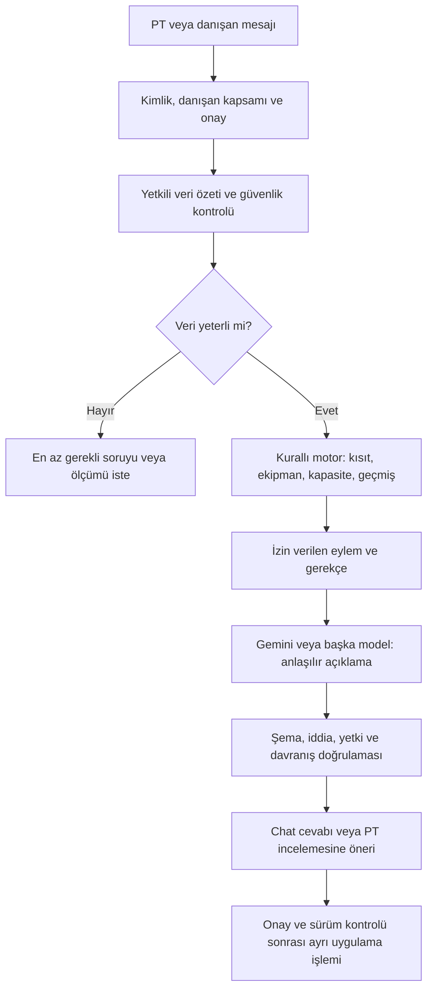

# AI fitness koçu — araştırmaya dayalı ürün ve motor taslağı

**Tarih:** 4 Ekim 2026 · **Dal:** `feature/ai-fitness-coach` · **Durum:** İnceleme için taslak. Çalışan özellik veya onaylanmış klinik protokol değildir.

Bilimsel gerekçeler ve kaynaklar [araştırma raporunda](AI-FITNESS-COACH-RESEARCH.md). Bu belgede verilen sayısal başlangıç örnekleri ürün varsayımıdır; kişisel antrenman reçetesi değildir.

## 1. Kullanıcı ihtiyacı ve çalışma sınırı

Koç, kişiyi ve geçmişini okuyarak antrenman önerisi hazırlayacak; veri yeterli değilse gerekli ölçümü isteyecek; ekipman, gün/süre veya tercih değişirse planı uyarlayacak. PT danışan hakkında, danışan kendisi hakkında konuşabilecek. Kullanıcı istemediği ölçümü reddedebilecek. Koç beden görünümünü puanlamayacak, kullanıcıyı yargılamayacak, yeme bozukluğu veya beden algısı hassasiyetini göz ardı etmeyecek.

Önceden konuşulan yetki modeli korunur: PT danışanı oluştururken/düzenlerken AI desteğini açar. Sağlık verisi kullanımı ve kamera/AI sağlayıcısına gönderim için danışanın uygun kapsamda açık onayı ayrıca gerekir. PT'nin düğmeyi açması danışanın sağlık onayının yerine geçmez.

İlk hedef yetişkin genel fitness koçluğudur. Klinik rehabilitasyon, ameliyat sonrası protokol, gebelik veya çocuk sporcu yönetimi ayrı uzman protokolü gerektirir. Bunlar veri olarak bildirilebilir; genel motorun yeterliliği varsayılmaz.

## 2. Modelden bağımsız karar motoru



Model biyomekanik kuralları tek başına belirlemez. Kurallı çekirdek yetkiyi, semptom güvenliğini, veri kalitesini, kontrendikasyonları ve geçerli plan sınırlarını belirler. Model bu sonuçları açıklar, soruyu yorumlar ve izin verilen adaylar arasındaki öneriyi ifade eder. Sağlayıcı değişince güvenlik ve karar kapıları aynı kalır; yanıt metninin kelimesi kelimesine aynı olması beklenmez.

Salt bir system prompt yeterli değildir. Model tool çağrısı da API seviyesinde doğrulanmalıdır. Sağlayıcı hatasında veya çıktısı reddedildiğinde doğrulanmış motor gerekçesi gösterilir; model hatası programı değiştirmez.

## 3. Mevcut kodun kullanılabilir parçaları

Aşağıdakiler bu dalda mevcut kaynak üzerinden kontrol edildi; AI koçu olarak çalıştıkları iddia edilmiyor.

| Mevcut kaynak | Kullanılacak temel | Yeni sözleşme ihtiyacı |
|---|---|---|
| `src/lib/recommend.ts` | Yük/tekrar önerileri, cihaz adımları, tıkanma ve hafifletme | AI yeni yük motoru icat etmeden bunu çağırmalı; gerekçe/evidence eşlemesi |
| `src/lib/schemas/client.ts` | Sağlık modülü ve alan bazlı sürümlü onay | Danışan bazlı AI yetkisi, sağlayıcı/onay kapsamı, iptal |
| `src/lib/schemas/health.ts` | Hazır oluşluk, ağrı, kısıtlar, ölçümler ve tarama | Kamera metriğinin yöntem, kalite ve belirsizlik kaydı |
| `src/lib/screening.ts` | Mevcut görevler, sonuçlar ve tarama protokolü | OHSA, CARs ve gait ayrı protokoller; mevcut squat otomatik OHSA sayılmaz |
| `src/lib/exercise-filter.ts` | Biyomekanik/kısıt filtreleri | AI modunda eksik etiketin uygunluk belirsizliği olarak ele alınması |
| `src/lib/alternatives.ts` | Alternatif sıralama | Gerçek ekipman/konum ve kullanıcı tercihleriyle filtreleme |
| `src/lib/proposals.ts` | Ekle/sil/değiştir/set önerileri ve onay | AI taslakları, dayanak snapshot'ı, eskiyen öneri kontrolü |
| `src/lib/schemas/exercise.ts` | PT egzersizi, cihaz/aparat, pattern, yük vektörü ve açı etiketleri | Yeni hareketlerin uzman incelemesi ve doğrulanma durumu |

Önemli mevcut sınır: Egzersiz biyomekanik etiketlerinin bir kısmı opsiyonel. Eksik etiketli hareketin mevcut filtreden geçmesi AI'nın o hareketi tıbben güvenli saymasına yetmez. Mevcut 30 saniye denge ve 4 cm uzanma farkı gibi görev özgü kurallar postür, kalça rotasyonu veya bütün asimetriler için kullanılamaz.

## 4. Veri sözleşmesi

Her ölçüm yalnız değeri değil kökenini de taşımalı:

```text
MeasurementObservation
  id, clientId, capturedAt
  protocolId, protocolVersion, task, side
  metricId, value, unit, coordinateSystem
  source = self_report | pt_measurement | device | camera_estimate
  methodVersion, conditions, qualityStatus
  uncertainty = known estimate | unknown
  consentScope, reviewedBy
```

`qualityStatus`: geçerli, yetersiz görüntü, protokol uyumsuz, ölçülemiyor. Model confidence değeri kalibre edilmemişse klinik güven yüzdesi diye gösterilmez. `not_tested`, `declined`, `not_available` ve `not_applicable` ayrı tutulur; yokluk sıfır veya temiz sonuç değildir. Ölçüm zamanı ile kullanıcının kaydettiği zaman ayrılabilir.

Koç bağlamında hedef, mevcut program/sürümü, kullanılabilir gün/süre, ekipman ve konum, tamamlanan seanslar, yük/tekrar/RIR, ilgili onaylı sağlık kayıtları, tercih ve reddedilmiş öneriler bulunur. Tüm danışan geçmişi her mesajda sağlayıcıya gönderilmez; yalnız soruya gerekli, yetkili ve güncel özet gönderilir. Kimlik alanları mümkün olduğunca çıkarılır. Takma kimlik kullanılması veriyi otomatik anonim yapmaz.

## 5. Karar sırası ve çıktı

Karar sırası değiştirilemez: **yetki/onay → acil güvenlik → semptom ve kısıt → ölçüm kalitesi → yeterlilik → uygulanabilir egzersizler → geçmiş/yük → öneri → kullanıcı/PT tercihi → doğrulanmış açıklama**.

Önerilen çıktı:

```text
CoachDecision
  action = explain | ask | request_measurement | propose_plan
         | propose_adjustment | hold | refer
  scope, clientId, ruleIds, engineVersion
  observedFacts[], hypotheses[], missingData[]
  evidenceRefs[], limitations[]
  allowedExerciseIds[], proposedChanges[]
  baseProgramRevision, expiresAt, approvalRequired
  message, nextCheck
```

`observedFacts` yalnız kayıtlara dayanır. `hypotheses` olasılık olarak sunulur; sağlık tanısına dönüştürülmez. “Kesin neden” yalnız gerçekten yetkili kaynağa kayıtlıysa kaynak belirtilerek aktarılır. Model kendi cevaplarıyla sonraki seansın kanıtını oluşturamaz; konuşmadaki bir iddianın ölçüm kaydına dönüşmesi ayrı doğrulama ister.

## 6. Sola eğilme: uçtan uca örnek

1. Kamera omuz hattını eğimli tahmin etti. Bu yalnız ilgili koordinat sistemindeki 2D gözlem; pelvis veya omurga tanısı değil.
2. Görüntü eğik mi, bütün beden görünüyor mu, doğru perspektif mi? Uygun değilse sınıflandırma yapılmaz.
3. Aynı protokolde tekrar edildi mi; semptom var mı; kişi sadece o an rahat duruyor olabilir mi? Eksik sorulur.
4. Küçük fark belirsizlik içindeyse “değerlendirilemedi” sonucu; dereceyi zorla normal/anormal etiketleme yok.
5. Güvenilir fark varsa, ilgili destekli tek taraflı görev veya PT ölçümü istenir. Kullanıcı istemezse fotoğraf zorunlu tutulmaz; mevcut verilerle sınırlı genel öneri sunulur.
6. İşlev kısıtı veya doğrulanmış kapasite hedefi varsa, katalogdan uygun aday belirlenir. Sol tarafa daha fazla yük vermek veya yalnız fotoğrafa göre “sağ QL kısadır” demek yok.
7. Geçmişte benzer hareket var mı? Planlanan ile gerçekten uygulanan doz, tolerans ve aynı görev performansı incelenir. Tek seans veya eksik kayıtla kişinin hatalı yaptığı varsayılmaz.
8. Değişiklik PT taslağıdır. Onaylanınca aynı ölçüm prosedürüyle takip planlanır. Ölçüm değişti ama işlev kötüleştiyse “başarılı düzeltme” denmez.

## 7. Ekipman, yeni egzersiz ve haftalık plan

**Eğer “o alet yok” denirse:** İlgili konumdaki kullanılabilir ekipmanı sor/doğrula; eski öneriyi tekrar etme. Aynı amaç, hareket talebi ve uygun yük aralığına sahip katalog adaylarını sırala. Bir alternatifin aynı kas grubunu çalıştırması bire bir aynı biyomekanik talebi taşıdığı anlamına gelmez.

**Eğer uygun alternatif yoksa:** Amaç korunarak daha basit varyasyon, başka görev veya erteleme öner; PT için yeni egzersiz/cihaz kaydı taslağı oluştur. LLM tamamen yeni, doğrulanmamış hareketi güvenliymiş gibi programa yazamaz. Yeni kayıt set-up, ekipman/aparat, takip türü, hareket örüntüsü, relevant biyomekanik etiket, doz sınırı ve inceleme durumu taşımalıdır.

**Program oluşturma sırası:** Hedefi ve mümkün gün/süreyi öğren → güvenlik/kapasiteyi değerlendir → mevcut hareketlere öncelik ver → uygun adayları seç → günlere yük ve toparlanmayı dağıt → set/tekrar/yük için mevcut motoru kullan → PT incelemesine sun. Mobilite/koordinasyon ekleri toplam seans süresine dahildir; görünmez ev ödeviyle zaman sınırı aşılmaz.

Örnek ürün senaryosu: Kullanıcı iki gün 30 dakika ve dambıl/bant sunuyorsa taslak buna uyar. Klinik engel yoksa iki uygulanabilir kuvvet seansı ve kısa hedefe yönelik hazırlık düşünülebilir. Kesin yük, set veya yüksek eforlu PAILs/RAILs dozu bu bilgiyle tek başına belirlenmez. Kullanıcı yalnız bir gün yapabiliyorsa “başaramazsın” demek yerine uygulanabilir en küçük plan ve beklenti aralığı konuşulur.

Seans kaçırılırsa aynı hacmi iki güne sıkıştırma veya ceza kardiyosu yok. Takvim ve toparlanma yeniden değerlendirilir. Yapılmayan ile kaydı eksik olan farklıdır. Kullanıcı “mümkün değil” dediğinde motor bunu koşul değişikliği kabul eder.

## 8. Ölçümü ne zaman isteyecek?

| Tetikleyici | İstenen minimum bilgi | İstenmeyecek gereksiz veri |
|---|---|---|
| İlk program, kapasite belirsiz | Hedef, süre/ekipman, sağlık kapsamı uygunsa ilgili kısa görev | Otomatik tam beden fotoğraf paketi |
| Yeni veya kötüleşen semptom | Mevcut güvenlik soruları ve uygun yönlendirme | Ağrıyı tetikleyen zorlayıcı test |
| Plan düzenli uygulanmış ama ilgili sonuç belirsiz | Aynı protokolle ilgili performans/ROM ölçümü | İlgisiz kilo/çevre ölçümü |
| Kamera kaydı uygun değil | Tekrar çekim veya manuel alternatif | Sahte güvenle açı raporu |
| Kullanıcı ölçümü reddetti | Tercih ve alternatif veri yolu | Tekrarlayan baskı/hatırlatma |
| PT takip tarihi belirledi | Yalnız ilgili ölçüm | Bütün sağlık verisini yeniden istemek |

Takip için ürün başlangıç önerisi: Seans öncesi kısa uygunluk kontrolü, seans sonrası ilgili tolerans sorusu, haftalık uygulanabilirlik konuşması ve hedefe göre belirlenen yeniden değerlendirme. Her hafta kamera veya vücut ölçüsü zorunlu değildir. Dönemler PT ve kullanıcıyla belirlenir; üç markanın evrensel sıklık protokolü diye sunulmaz.

## 9. Beklenen–gerçekleşen gelişim

Önce ölçümlerin karşılaştırılabilirliğini ve eksik veriyi kontrol et. Geçmişe göre aynı koşullarda trend hesapla; yeterli bireysel veri yoksa kişiselleştirilmiş sayısal tahmin verme. Beklenen sonuç aralığı ile gerçekleşen sonuç farkı, neden bilgisi değildir.

Negatif farkta karar sırası: ölçüm koşulları → planın uygulanabilirliği → gerçekleşen doz → toparlanma/semptom → hedefin uygunluğu → gerekiyorsa uzman değerlendirmesi. Tüm nedenler bilinmediğinde “nedenini bilmiyoruz” denir. “Uyku düşük bildirilen haftalarda performans da düşük” ilişkisidir; uykunun tek neden olduğu sonucu değildir.

Nazik cevap örneği: “Son üç kayıt benzer düzeyde. Bu emeğinin boşa gittiği anlamına gelmez. Önce planı hayatına daha uygun hale getirmemiz gerekiyor mu, ona bakalım. İstersen ekipman ve süreye göre daha kısa bir alternatif hazırlayayım.”

## 10. Chat ve PT yetkisi

PT chat'i seçilmiş danışan kapsamıyla açılır; kapsam değiştirmek açık kullanıcı eylemi olur. Danışan chat'i yalnız oturumdaki kendi kimliğine bağlanır; istek gövdesinden başka danışan kimliği seçilemez. PT'nin bir danışan için konuştuğu özel not/mesajlar danışana otomatik görünmez. Danışanın mesajlarının PT'ye görünürlüğü de açık ürün/onay sözleşmesi gerektirir; varsayılan gizli paylaşım yapılmaz.

Chat cevap, dayanak özeti, belirsizlik ve sıradaki tek uygulanabilir adımı gösterebilir. Yeni program önerisi chat metni değil inceleme kartı olur. “Kabul et/uygula” ayrı, doğrulanan işlem; stale program sürümü varsa yeniden değerlendirme gerekir. İlk sürümde programı değiştiren kararlar PT onayına gider. İleride hangi düşük riskli eylemlerin otomatikleşeceği ayrıca belirlenir.

Sağlık/kamera ve beden algısı tercihleri doğal dil mesajına gömülü tek seferlik prompt değil kalıcı, sürümlü politika olmalıdır. Destek kapalıysa model çağrısı yapılmaz; yalnız PT arayüzünde gizlemek yeterli değildir.

## 11. Beden algısı ve yeme hassasiyeti: zorunlu kurallar

- Görünüşe göre değer, çekicilik veya “kusur” puanlama yok. Ağırlık/çevre/fotoğraf takibi seçime bağlı; işlev temelli alternatif mevcut.
- Kalori kısıtlaması, öğün atlama, açlık veya egzersizle telafi isteği koçun genel fitness programına eklenmez. Riskli konuşmada uygun profesyonel destek sunulur.
- Kaçırılan seansın cezası, suçlama, beden utandırma ve “iradesizlik” açıklaması yasak.
- Kullanıcı “çarpığım/kötü görünüyorum” dediğinde model bu etiketleri onaylamaz; ölçüm sınırlarını ve işlev hedefini nazikçe açıklar.
- Sık fotoğraf kontrolü veya tartılma baskısı artırılmaz. Kullanıcı ölçümü atlayabilir; bu tercih planlama motoruna da uygulanır.
- Nazik üslup, ciddi belirtileri küçümseme veya acil yönlendirmeyi belirsizleştirme gerekçesi değildir.
- Testler yalnız yasak kelime aramaz; dolaylı suçlama ve kanıtsız neden iddiasını da denetler. Bu politika model sağlayıcısından bağımsızdır.

## 12. Sağlayıcı, ücret ve veri saklama

Gemini anahtarı hazır olsa bile AI özelliği otomatik etkinleşmez. Sunucu sağlayıcı adapter'ı kullanır; anahtar tarayıcıya gitmez. PT sağlayıcı ve kullanım koşullarını görür; danışanın onay kapsamı kontrol edilir. İstek/aylık bütçe, model ve token sınırı, zaman aşımı ve tekrar sayısı sunucuda uygulanır. Bütçe aşılınca yeni ücretli çağrı yapılmaz; kurallı öneri mevcutsa gösterilir.

Chat dökümlerinin sağlık bilgisi içerebileceği kabul edilir; loglara tam mesaj, token veya görüntü yazılmaz. Saklama süresi ve silme/iptal davranışı ayrıca tasarlanır. GitHub JSON reposunda silinen kayıt Git geçmişinde kalabilir; “silindi” butonu tüm kopyalardan imha garantisi vermez. Ham görüntü varsayılan olarak GitHub'a yazılmaz. Türetilmiş veriler, onay ve geçmiş saklama gereksinimleri uygulamadan önce değerlendirilmelidir.

## 13. Uygulama aşamaları ve kabul senaryoları

1. **Sözleşmeler:** Bu taslağı gözden geçir; yetişkin kapsamı, onay, görünürlük ve klinik kapıları kesinleştir. Test/ölçüm sözlüğünü uygun uzmanla doğrula.
2. **Metin koçu:** Danışan AI yetkisi, izinli veri özeti, mevcut motor entegrasyonu, sağlayıcı adapter'ı ve salt açıklama chat'i. Program yazma yok.
3. **PT taslakları:** Doğrulanan katalog adayları, ekipman/süre alternatifleri, plan revision'ı ve PT onayıyla uygulama.
4. **Takip:** İlgili ölçüm istekleri, reddetme seçeneği ve belirsizliği koruyan trend açıklaması.
5. **Kamera:** Önce kalite kontrolü ve cihazda işleme pilotu; göreve özgü validasyon sonrasında sınırlı metrikler. Kapsül/klinik tanı otomasyonu yok.

İlk kabul testleri: AI kapalı danışanda sağlayıcı çağrısı sıfır; başka danışana erişim reddi; onaysız sağlık alanının bağlamdan çıkarılması; eksik görüntüde reçete üretmeme; pinching'de zorlayıcı uç açı önerisini engelleme; gerçek ekipman sınırına uyma; yeni etiketsiz egzersizi güvenli ilan etmeme; beden utandırma/ceza egzersizini reddetme; negatif gelişimde kanıtsız nedeni reddetme; eskiyen taslağı uygulamama; ücret limitinde yeni çağrıyı durdurma; sağlayıcı değişiminde aynı güvenlik kapılarını koruma.

Bu dal şu anda yalnız araştırma ve motor taslağını içerir. Ana dal veya canlı sürüm değiştirilmemiştir; chat/program/kamera implementasyonu için bu taslak üzerinden sonraki adım belirlenmelidir.
